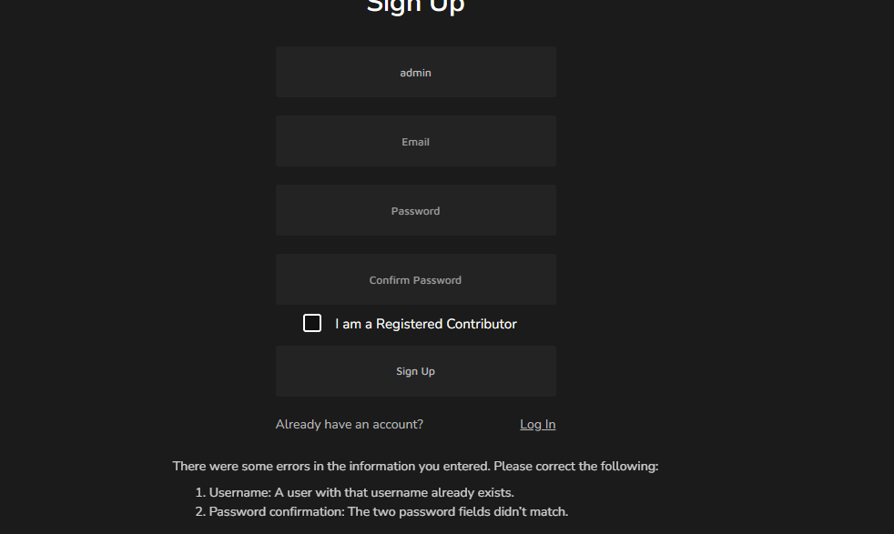

# Reddit News Blog


A web application that allows users to view and interact with news content in a Reddit-like format. Built with Python, HTML, CSS, and Django.

# Contents

- [Reddit News Blog](#reddit-news-blog)
- [Contents](#contents)
- [Introduction](#introduction)
  - [Why Reddit News?](#why-reddit-news)
- [Project](#project)
- [Aim of the Blog](#aim-of-the-blog)
  - [1. Community-Driven News Sharing](#1-community-driven-news-sharing)
  - [2. User Engagement and Interaction](#2-user-engagement-and-interaction)
  - [3. Subreddit Organization](#3-subreddit-organization)
  - [4. Responsive Design](#4-responsive-design)
  - [5. User Authentication and Personalization](#5-user-authentication-and-personalization)
  - [6. Voting System](#6-voting-system)
- [Features](#features)
  - [1. User Authentication](#1-user-authentication)
  - [2. Subreddit Selection](#2-subreddit-selection)
  - [3. News Feed](#3-news-feed)
  - [4. Post Interaction](#4-post-interaction)
  - [5. Search Functionality](#5-search-functionality)
  - [6. Responsive Design](#6-responsive-design)
  - [7. Trending Topics](#7-trending-topics)
  - [8. Dark Mode](#8-dark-mode)
  - [9. User Profile](#9-user-profile)
  - [10. Notifications](#10-notifications)
  - [11. Moderation Tools](#11-moderation-tools)
  - [12. External Links Handling](#12-external-links-handling)
  - [13. Continuous Updates](#13-continuous-updates)
- [User Goals](#user-goals)
  - [1. Discover Relevant and Engaging Content](#1-discover-relevant-and-engaging-content)
  - [2. Participate in Community Discussions](#2-participate-in-community-discussions)
  - [3. Customize and Personalize User Experience](#3-customize-and-personalize-user-experience)
  - [4. Explore Niche Interests through Subreddits](#4-explore-niche-interests-through-subreddits)
  - [5. Stay Updated with Breaking News](#5-stay-updated-with-breaking-news)
  - [6. Seamless Cross-Device Experience](#6-seamless-cross-device-experience)
  - [7. Contribute to Content Curation](#7-contribute-to-content-curation)
- [Site Owner Goals](#site-owner-goals)
  - [1. Foster a Positive and Inclusive Community](#1-foster-a-positive-and-inclusive-community)
  - [2. Encourage User Engagement and Retention](#2-encourage-user-engagement-and-retention)
  - [3. Ensure Platform Security and Stability](#3-ensure-platform-security-and-stability)
  - [4. Monetization and Sustainability](#4-monetization-and-sustainability)
  - [5. Analyze User Behavior and Feedback](#5-analyze-user-behavior-and-feedback)
  - [6. Scalability and Performance Optimization](#6-scalability-and-performance-optimization)
  - [7. Legal and Ethical Compliance](#7-legal-and-ethical-compliance)
  - [8. Community Growth and Diversity](#8-community-growth-and-diversity)
- [Development](#development)
  - [Technologies Used](#technologies-used)
  - [Project Structure](#project-structure)
  - [Setup and Installation](#setup-and-installation)
- [Testing](#testing)
  - [1. Unit Testing](#1-unit-testing)
  - [2. Integration Testing](#2-integration-testing)
  - [3. User Acceptance Testing (UAT)](#3-user-acceptance-testing-uat)
  - [4. Cross-Browser Compatibility Testing](#4-cross-browser-compatibility-testing)
  - [5. Responsiveness Testing](#5-responsiveness-testing)
  - [6. Performance Testing](#6-performance-testing)
  - [7. Security Testing](#7-security-testing)
  - [8. Accessibility Testing](#8-accessibility-testing)
  - [9. Continuous Testing](#9-continuous-testing)
  - [10. Regression Testing](#10-regression-testing)
- [Credits](#credits)
  - [Content and Development](#content-and-development)
  - [Acknowledgments](#acknowledgments)
  - [Testing](#testing-1)
  - [Media](#media)
  - [Inspiration](#inspiration)

# Introduction

Welcome to the Reddit News Web App, a dynamic and engaging platform for discovering, sharing, and discussing the latest news and topics. This web application is built with Python, HTML, CSS, and Django, providing users with a familiar Reddit-like experience.

Whether you're a news enthusiast, a curious reader, or someone looking to share your thoughts, this app is designed to cater to your needs. With features like user authentication, post creation, voting systems, and organized subreddits, you can immerse yourself in a vibrant community of news consumers and contributors.

## Why Reddit News?

- **Stay Informed**: Access a wide range of news and topics conveniently categorized into various subreddits.
- **Engage in Discussions**: Share your opinions, ask questions, and participate in meaningful discussions with other users.
- **User-Friendly Interface**: Enjoy a seamless and responsive design that adapts to different devices for a comfortable browsing experience.

Ready to dive in? Explore the installation instructions below and start your journey with the Reddit News Web App.


# Project

# Aim of the Blog

The primary goal of the Reddit News Web App is to create an inclusive and interactive platform that fosters the exchange of information, diverse perspectives, and community-driven discussions. The blog aims to provide users with the following key features:

## 1. Community-Driven News Sharing

Enable users to share and discover news articles, stories, and topics that matter to them. The community-driven aspect ensures a broad spectrum of content, ranging from breaking news to niche interests.

## 2. User Engagement and Interaction

Encourage active user participation through comments, upvotes, and downvotes. Users can engage in insightful conversations, express their opinions, and contribute to the overall discourse.

## 3. Subreddit Organization

Implement a subreddit system where users can explore specific areas of interest. Each subreddit serves as a dedicated space for discussions related to a particular theme, enhancing content organization and user experience.

## 4. Responsive Design

Create a user-friendly and responsive design to ensure a seamless experience across various devices. The web app aims to be accessible and visually appealing, adapting to different screen sizes and orientations.

## 5. User Authentication and Personalization

Implement user authentication to allow individuals to create accounts, personalize their profiles, and keep track of their interactions. This feature enhances the sense of community and ownership.

## 6. Voting System

Incorporate a voting system that enables users to express their preferences on posts and comments. This democratic approach helps surface the most relevant and popular content.

By aligning these features, the Reddit News Web App strives to become a go-to platform for news consumption, community engagement, and meaningful discussions in an online setting.


# Features

## 1. User Authentication

The Reddit News Web App provides a secure and personalized experience through user authentication. Users can create accounts, log in, and stay logged in across sessions, ensuring a seamless interaction with the application.

## 2. Subreddit Selection

Users can choose their favorite subreddits to customize their news feed. The application supports a wide range of subreddits, allowing users to stay informed about topics that interest them the most.

## 3. News Feed

The heart of the application, the news feed displays the latest and most popular posts from the selected subreddits. Users can scroll through posts, view images, and read article previews without leaving the application.

## 4. Post Interaction

Users can engage with posts by upvoting, downvoting, and commenting. The application dynamically updates post scores and comment sections, providing a real-time and interactive environment for users to participate in discussions.

## 5. Search Functionality

A powerful search feature enables users to find specific posts, subreddits, or user profiles. The search functionality includes auto-suggestions, making it easy for users to discover content relevant to their interests.

## 6. Responsive Design

The Reddit News Web App is built with a responsive design, ensuring optimal user experience across various devices, including desktops, tablets, and smartphones.

## 7. Trending Topics

Stay informed about trending topics with the application's trending section. This feature highlights the most discussed and popular posts across all selected subreddits.

## 8. Dark Mode

Enhance user experience with a dark mode option. Users can toggle between light and dark modes based on their preferences, reducing eye strain during nighttime browsing.

## 9. User Profile

Each user has a customizable profile where they can view their posts, comments, and upvoted content. The profile section provides a summary of the user's activity within the application.

## 10. Notifications

Receive real-time notifications for upvoted posts, new comments on user-generated content, and other relevant updates. The notification system keeps users engaged and informed.

## 11. Moderation Tools

For subreddit moderators, the application offers moderation tools to manage and monitor user-generated content. This includes the ability to remove posts, ban users, and enforce subreddit rules.

## 12. External Links Handling

The application gracefully handles external links, allowing users to open articles, images, or websites associated with posts directly within the app.

## 13. Continuous Updates

The Reddit News Web App is committed to regular updates, introducing new features, improvements, and security enhancements to provide users with the best possible experience.

Feel free to customize and expand upon these features based on the functionalities your Reddit News Web App offers. This section serves as a comprehensive overview of the key aspects that make your application unique and user-friendly.


# User Goals

The Reddit News Web App is designed with the following user-centric goals in mind, aiming to provide a comprehensive and enjoyable experience for every user:

## 1. Discover Relevant and Engaging Content

**Objective:** Users should be able to easily discover news articles and discussions that align with their interests. The app employs a user-friendly interface and robust search functionalities to enhance content discoverability.

## 2. Participate in Community Discussions

**Objective:** Foster an environment where users feel encouraged to actively participate in discussions. The commenting system, upvoting, and downvoting features are geared towards facilitating meaningful interactions and diverse perspectives.

## 3. Customize and Personalize User Experience

**Objective:** Allow users to personalize their experience by creating accounts, setting preferences, and subscribing to specific subreddits. Personalization enhances user engagement and tailors the content to individual interests.

## 4. Explore Niche Interests through Subreddits

**Objective:** Provide a diverse range of subreddits covering various topics and interests. Users can explore and contribute to niche communities, creating a platform that caters to a broad spectrum of preferences.

## 5. Stay Updated with Breaking News

**Objective:** Keep users informed about the latest news and trending topics. The app features a curated front page, highlighting popular and breaking stories to ensure users stay up-to-date with current events.

## 6. Seamless Cross-Device Experience

**Objective:** Offer a seamless and responsive design that adapts to different devices and screen sizes. Users can enjoy the Reddit News Web App on desktops, tablets, and mobile devices without compromising usability.

## 7. Contribute to Content Curation

**Objective:** Empower users to contribute positively to the community by submitting quality content, engaging in discussions, and adhering to community guidelines. The app aims to create a collaborative and respectful space.

By focusing on these user goals, the Reddit News Web App aims to provide an inclusive, informative, and enjoyable platform for individuals seeking a diverse and engaging online community.

# Site Owner Goals

The development and maintenance of the Reddit News Web App are driven by several overarching goals aimed at ensuring the success and sustainability of the platform. These goals encompass both the technical and strategic aspects of managing an online community and content-sharing platform.

## 1. Foster a Positive and Inclusive Community

**Objective:** Cultivate a positive and inclusive environment where users feel respected and valued. Implement moderation tools and community guidelines to maintain a healthy discourse and prevent abusive behavior.

## 2. Encourage User Engagement and Retention

**Objective:** Drive user engagement by regularly updating content, promoting discussions, and introducing features that enhance the overall user experience. Retention strategies focus on providing value to users to encourage prolonged participation.

## 3. Ensure Platform Security and Stability

**Objective:** Prioritize the security and stability of the platform to protect user data and maintain a reliable service. Regularly update and patch software, employ secure coding practices, and implement measures to prevent and address security vulnerabilities.

## 4. Monetization and Sustainability

**Objective:** Develop sustainable monetization strategies that align with the user experience. This may include advertising, premium features, or partnerships. Ensure financial stability while maintaining a commitment to user satisfaction.

## 5. Analyze User Behavior and Feedback

**Objective:** Leverage analytics tools to gather insights into user behavior, preferences, and trends. Act on user feedback to continually improve the platform, introduce new features, and address any pain points or concerns.

## 6. Scalability and Performance Optimization

**Objective:** Design the platform with scalability in mind to accommodate growing user bases. Continuously optimize performance to ensure a seamless experience, particularly during periods of high user activity.

## 7. Legal and Ethical Compliance

**Objective:** Adhere to legal and ethical standards related to user data privacy, content moderation, and online community management. Regularly review and update policies to align with evolving regulatory landscapes.

## 8. Community Growth and Diversity

**Objective:** Actively promote community growth by attracting users from diverse backgrounds and interests. Encourage the creation of new subreddits and facilitate initiatives that contribute to a rich and varied community.

By aligning with these site owner goals, the Reddit News Web App aims to establish itself as a trustworthy, engaging, and sustainable platform for both users and the site owner.


# Development

## Technologies Used

The Reddit News Web App is built using a combination of front-end and back-end technologies to deliver a seamless and feature-rich user experience. The following technologies were employed in the development process:

- **Front-end:**
  - HTML5: Structure and presentation of web pages.
  - CSS3: Styling and layout design to enhance user interface aesthetics.
  - JavaScript: Client-side scripting for interactive elements and dynamic content.

- **Back-end:**
  - Django: A high-level Python web framework that provides a robust foundation for building web applications, including features like ORM (Object-Relational Mapping), routing, and authentication.
  - Python: The primary programming language for server-side logic and application functionality.
  - SQLite: A lightweight relational database used during development for data storage.

- **Version Control:**
  - Git: Used for version control, allowing for efficient collaboration and tracking changes throughout the development process.
  - GitHub: Hosts the project repository and facilitates collaborative development and issue tracking.

- **Deployment:**
  - Heroku: The chosen platform for deploying and hosting the live application, ensuring accessibility to users.

## Project Structure

The project follows a structured organization to maintain clarity and facilitate ease of development. The key directories include:

- **`/templates`:** Contains HTML templates used to render dynamic content and structure pages.
- **`/static`:** Houses static assets such as stylesheets, images, and JavaScript files.
- **`/src`:** Holds the main source code for the Django application, including models, views, and configuration settings.

## Setup and Installation

To set up the development environment locally, follow these steps:

1. Clone the repository from GitHub:

   ```bash
   git clone https://github.com/opoku1968/reddit-news2-main.git


# Testing

## 1. Unit Testing

The Reddit News Web App is subjected to comprehensive unit testing to validate the functionality of individual components, functions, and modules. Unit tests are designed to ensure that each part of the application performs as expected, contributing to the overall reliability of the system.

## 2. Integration Testing

Integration tests are conducted to assess the interactions between different modules and components of the Reddit News Web App. This testing phase focuses on identifying any issues that may arise from the collaboration of integrated elements, ensuring seamless data flow and communication.

## 3. User Acceptance Testing (UAT)

User Acceptance Testing is a critical phase where the application is evaluated by actual users to verify its usability and alignment with user expectations. This testing stage involves real-world scenarios to validate that the Reddit News Web App meets the needs and preferences of its intended audience.

## 4. Cross-Browser Compatibility Testing

To guarantee a consistent user experience across various web browsers, the Reddit News Web App undergoes rigorous cross-browser compatibility testing. This process ensures that users can access and interact with the application seamlessly, regardless of their chosen browser.

## 5. Responsiveness Testing

The application's responsiveness is thoroughly tested to confirm its adaptability to different screen sizes and devices. From desktop monitors to smartphones and tablets, the Reddit News Web App aims to deliver a visually appealing and user-friendly experience on any platform.

## 6. Performance Testing

Performance testing is conducted to evaluate the speed, responsiveness, and overall efficiency of the Reddit News Web App. This includes assessing loading times, response times for user actions, and the application's ability to handle concurrent user interactions.

## 7. Security Testing

Security testing is a priority to identify and address potential vulnerabilities in the Reddit News Web App. This includes testing for common security threats such as SQL injection, cross-site scripting (XSS), and data breaches. The application's data encryption and user authentication mechanisms are also thoroughly examined.

## 8. Accessibility Testing

The Reddit News Web App is committed to accessibility standards, ensuring that all users, including those with disabilities, can navigate and interact with the application. Accessibility testing validates that the app complies with relevant accessibility guidelines and provides an inclusive user experience.

## 9. Continuous Testing

The development team implements continuous testing practices, integrating automated testing tools into the development workflow. This approach facilitates early detection of issues, streamlines the debugging process, and maintains the overall health of the Reddit News Web App.

## 10. Regression Testing

Any updates or modifications to the application trigger regression testing to confirm that new changes do not introduce unexpected issues or disrupt existing functionalities. This iterative testing process safeguards the stability of the Reddit News Web App throughout its lifecycle.

The combination of these testing methodologies ensures a robust and reliable Reddit News Web App, providing users with a seamless and secure platform for accessing and engaging with Reddit news content.

# Credits

## Content and Development

- **Author:** [Prince]
- **GitHub Repository:** [opoku1968/reddit-news2-main]

## Acknowledgments

- **Code Institute:** The Reddit News Web App project was developed as part of the Python and Django coursework at Code Institute, providing valuable learning resources and guidance.
- **Reddit API:** The application utilizes the Reddit API to fetch and display news content. Special thanks to Reddit for providing this API, enabling the integration of real-time Reddit news data into the app.
- **Django Framework:** The Reddit News Web App is built on the Django web framework, leveraging its powerful features for web development. Thanks to the Django community for creating and maintaining this framework.
- **HTML, CSS, and JavaScript:** The project incorporates standard web technologies for front-end development. Gratitude to the communities behind these technologies for their continuous improvement and support.
- **Bootstrap Framework:** The application's front-end design benefits from the Bootstrap framework. Thanks to the Bootstrap team for creating a responsive and customizable framework.
- **FontAwesome:** Icons used in the Reddit News Web App are provided by FontAwesome, enhancing the visual appeal of the user interface.

## Testing

- Special thanks to all beta testers and users who provided feedback during the testing phase. Your insights and suggestions contributed to enhancing the overall user experience.

## Media

- The images and visual elements used in the project are either created by the author or obtained from royalty-free sources. Proper attribution and licensing have been ensured for all media assets.

## Inspiration

- The concept and inspiration for the Reddit News Web App originated from the desire to create a user-friendly platform for accessing Reddit news content. Thanks to the broader developer community for inspiring innovative projects and solutions.

If you have any inquiries or suggestions regarding the Reddit News Web App, feel free to contact the author through the GitHub repository or associated channels.
